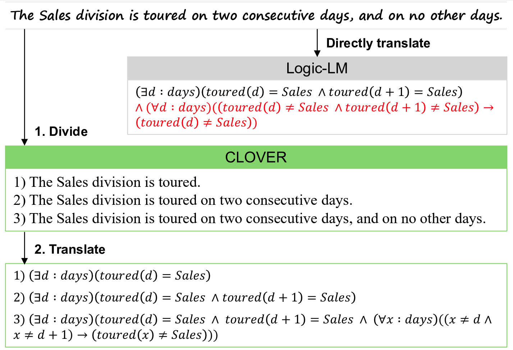

<h1 align="center">Divide and Translate: Compositional First-Order Logic Translation and Verification for Complex Logical Reasoning</h1>
<p align="center">

</p>

### Updates
Feb 19, 2025: The initial version of the code has been released.  
Jan 23, 2025: Our paper is accepted to **ICLR 2025**!

### Paper
Official source code for ["Divide and Translate: Compositional First-Order Logic Translation and Verification for Complex Logical Reasoning"](https://arxiv.org/abs/2410.08047), ICLR 2025 [[1]](#ref).

TL;DR: We introduce CLOVER, a neurosymbolic approach that enhances logical reasoning ability of LLMs by compositional translation of natural language into first-order logic (FOL) and verification of logical semantics.

## Setup
* python==3.9.19
* requirements: `pip install -r requirements.txt`

## Run experiments
Simply run the following script!
```bash
API_KEY="Your OpenAI API key"
DATASET="Dataset name [AR-LSAT | ZebraLogic]"
MODEL_NAME="Language model name [gpt-4o | gpt-4o-mini]"
VERIFICATION="FOL Verification method [logic_cp | logic_cs]"

scripts/run_${DATASET}.sh
```
For FOL verification, we provide two proposed methods and one additional baseline.
 - `logic_cs` (our's): *Logical Consistency* (Select the most frequent logically equivalent FOL formulas)
 - `logic_cp` (our's): *Disproving by Counter-Interpretation* (Disprove incorrect FOL formulas by counter-interpretation)
 - `logic_cp_lm` (baseline): LLM w/ instruction (Prompt an LLM to select the most probable FOL formula)

### Further Details
 - While using an LLM, you can change the number of maximum output tokens by controlling ```max_new_tokens```.
 - For evaluation, you can change ```backup_strategy``` from ```random``` to ```LLM``` and assign appropriate ```backup_LLM_result_path```.

## Citation
<a name="ref"></a>
```bash
@article{ryu2024divide,
  title={Divide and Translate: Compositional First-Order Logic Translation and Verification for Complex Logical Reasoning},
  author={Ryu, Hyun and Kim, Gyeongman and Lee, Hyemin S and Yang, Eunho},
  journal={arXiv preprint arXiv:2410.08047},
  year={2024}
}
```

## Misc.

- If you have any question, please leave an issue in our github repository or send an email to [Hyun](ryuhyun1905@kaist.ac.kr).
- Our code base is built upon [Logic-LM](https://github.com/teacherpeterpan/Logic-LLM).